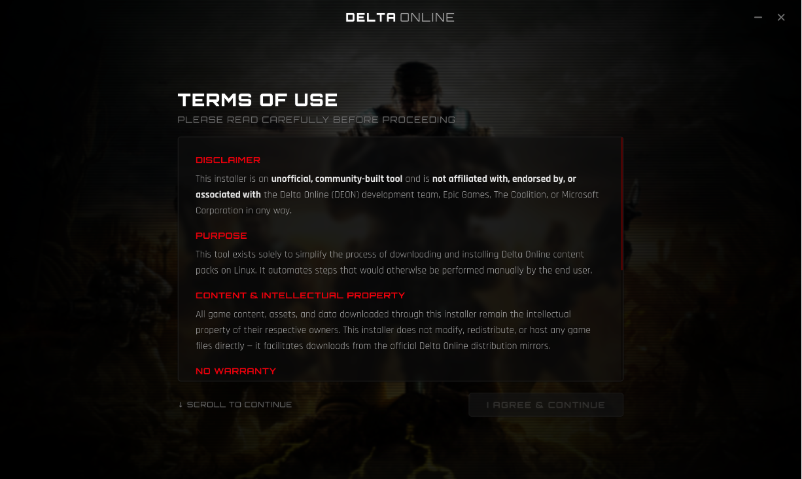
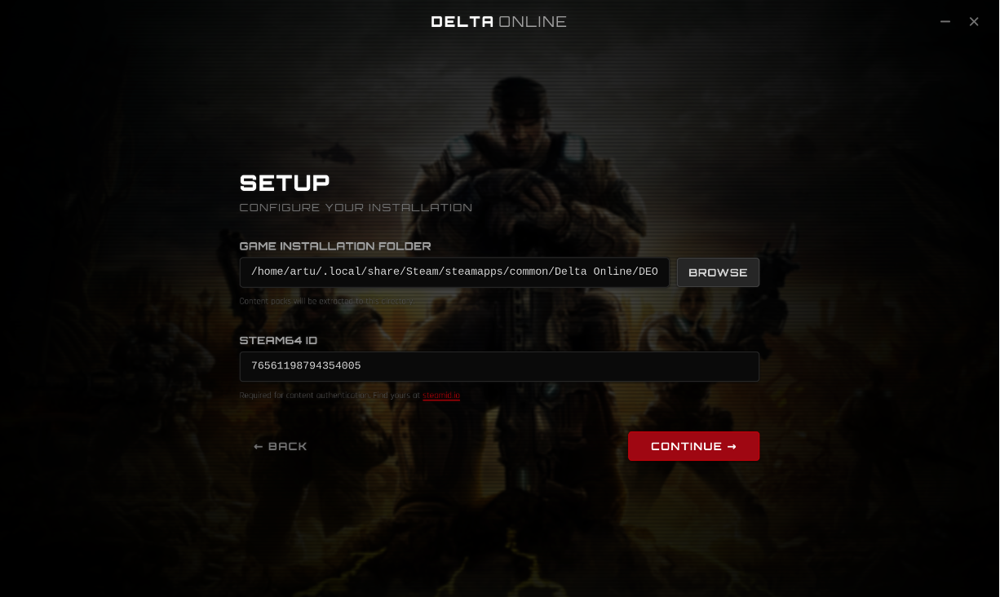
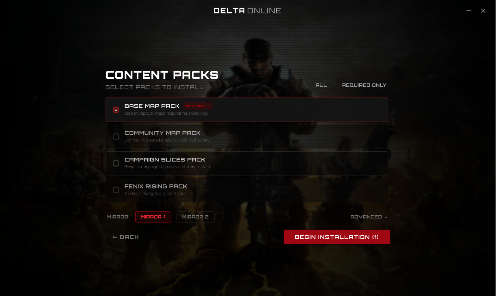
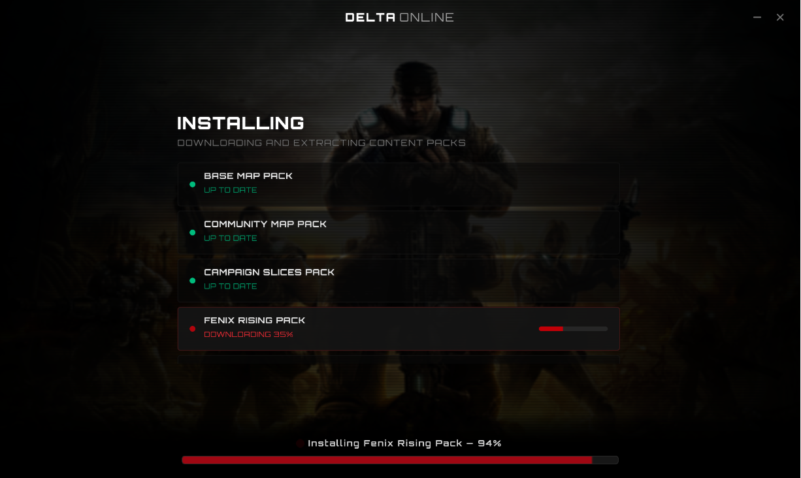
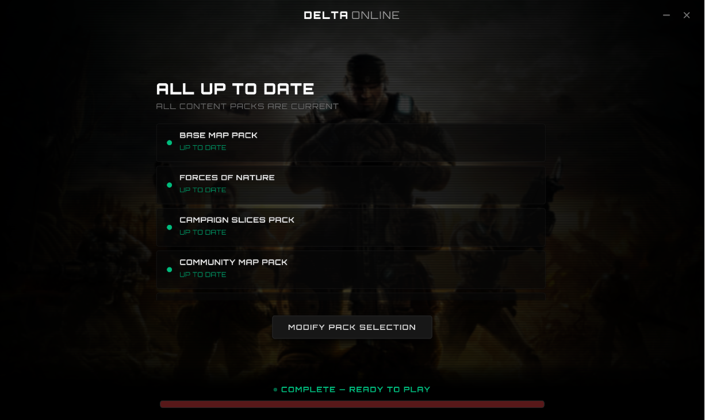

# DEON Linux Installer

A desktop installer designed to download, authenticate, and extract Delta Online (DEON) content packs (including map packs, DLCs, and campaigns) on Linux systems.


> #### Made with the help of Antigravity. Contributions are welcome.

## System Requirements

The application requires `7z` (provided by `p7zip`) to extract the downloaded `.deon` zip archives. Ensure it is installed on your system:

- **Ubuntu / Debian**:
```bash
sudo apt update && sudo apt install p7zip-full
```
- **Arch Linux**:
```bash
sudo pacman -S p7zip
```
- **Fedora**:
```bash
sudo dnf install p7zip p7zip-plugins
```

## Build and Development

### Install Node Dependencies
```bash
pnpm install
```

### Run in Development Mode
```bash
pnpm tauri dev
```

### Build Production Release
```bash
pnpm tauri build
```


## Screenshots






